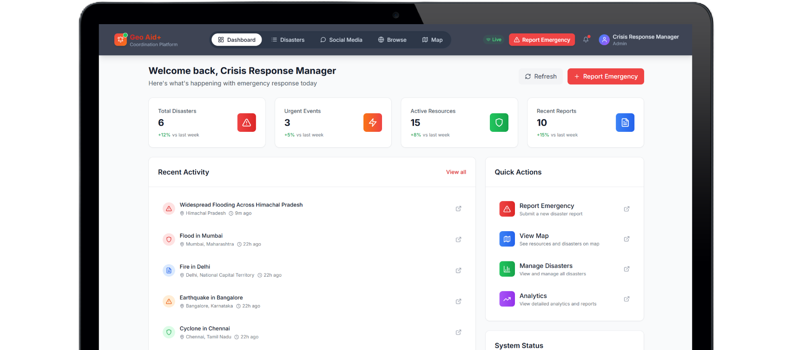
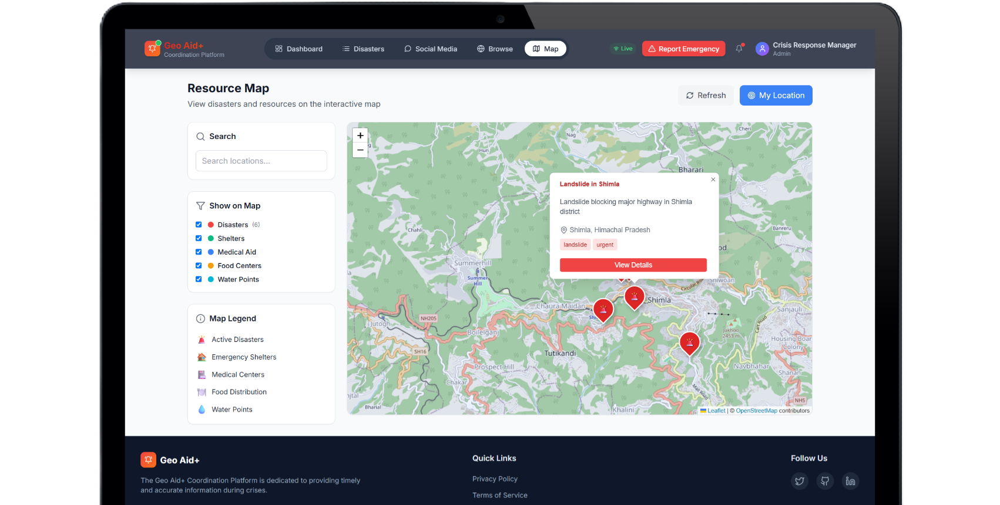
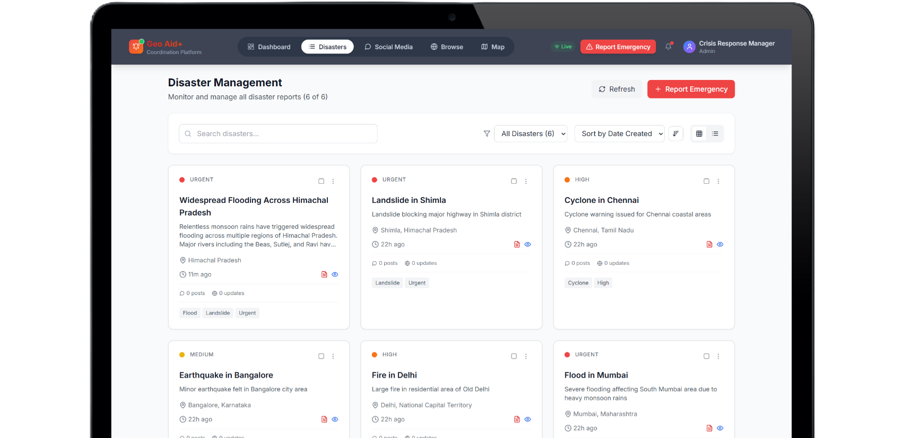
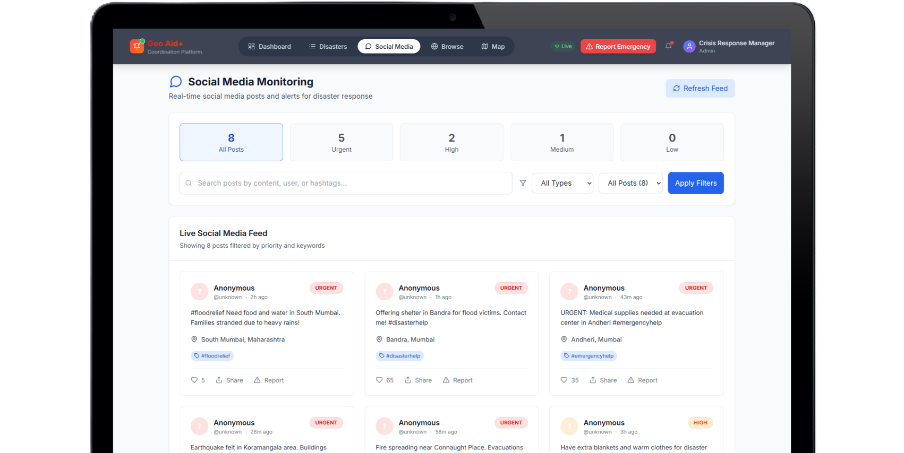
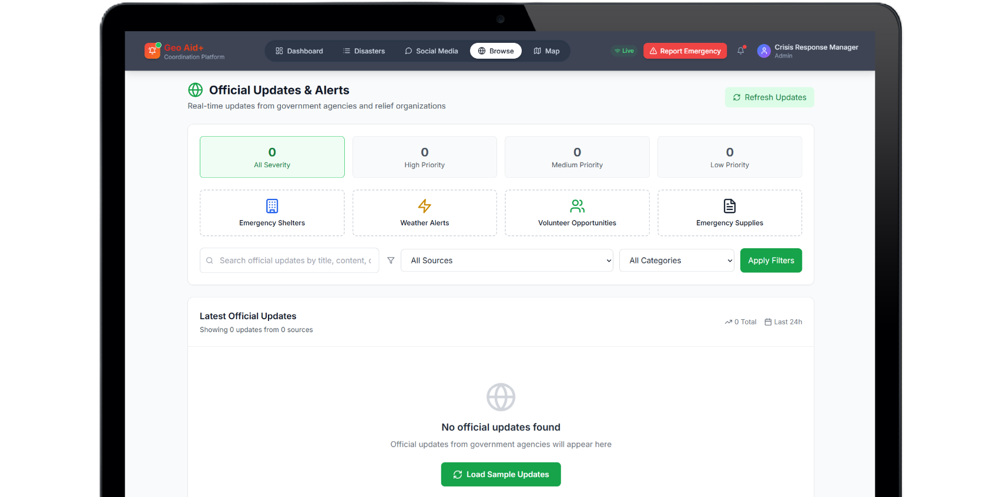

# Geo Aid+ : Real-Time Disaster Response Coordination Platform


<p align="center">
  <a href="#-features">Features</a> •
  <a href="#-screenshots">Screenshots</a> •
  <a href="#-tech-stack">Tech Stack</a> •
  <a href="#-getting-started">Getting Started</a> •
  <a href="#-license">License</a>
</p>

---

## ✨ Features

Geo Aid+ is a comprehensive, full-stack platform designed to provide critical, real-time information and coordination during emergency situations.

- **🗺️ Interactive Geospatial Map:** Visualize all disasters and resources on a live, interactive map.
- **🚨 Real-Time Disaster Reporting:** Instantly report emergencies with AI-powered location extraction.
- **📊 Dynamic Dashboard:** A stunning, pixel-perfect dashboard for at-a-glance situational awareness.
- **📱 Live Social Media Feeds:** Aggregate and analyze social media posts for real-time intelligence.
- **🏛️ Official Updates:** Scrape and display official news from government and aid organizations.
- **🔍 Advanced Filtering & Search:** Easily browse and filter disasters and resources.
- **🤖 AI-Powered Analysis:** Use Google Gemini to extract locations from descriptions and verify images.
- **🌐 Real-Time Websockets:** Live updates across the entire platform for seamless coordination.
- **🔐 Authentication & Authorization:** Secure routes and actions for authorized personnel.

## 📸 Screenshots

<summary>Click to view the app in action</summary>
<br/>
<em>The beautiful, pixel-perfect dashboard provides a complete overview of the situation.</em>

<br/><br/>
<em>The interactive map is the core of the platform, showing all disasters and resources.</em>

<br/><br/>
<em>Browse and filter all active disasters in a clean, organized list.</em>

<br/><br/>
<em>Monitor live social media feeds to gain real-time insights from the ground.</em>

<br/><br/>
<em>Aggregate and view official updates from trusted sources.</em>



## 🛠️ Tech Stack

| Category      | Technology                                                                                                  |
|---------------|-------------------------------------------------------------------------------------------------------------|
| **Frontend**  |      |
| **Backend**   |    |
| **Database**  |       |
| **AI**        |                                |
| **Deployment**|                                 |

## 🚀 Getting Started

Follow these instructions to get the project up and running on your local machine.

### Prerequisites

- [Node.js](https://nodejs.org/en/) (v18 or later)
- [npm](https://www.npmjs.com/)
- A [Supabase](https://supabase.com/) account for the database.
- A [Google Gemini API Key](https://aistudio.google.com/app/apikey) for AI features.

### Local Installation

1.  **Clone the repository:**
    ```sh
    git clone https://github.com/vipulkatwal/disaster-manage.git
    cd disaster-manage
    ```

2.  **Set up the Backend:**
    ```sh
    cd backend
    npm install
    cp .env.example .env
    ```
    > Fill in the variables in your new `.env` file with your credentials (Supabase, Gemini, etc.).

3.  **Set up the Frontend:**
    ```sh
    cd ../frontend
    npm install
    cp .env.example .env
    ```
    > Update `REACT_APP_API_URL` in the `.env` file if your backend is not running on port 5000.

4.  **Set up the Database Schema:**
    - Navigate to the SQL Editor in your Supabase project.
    - Open the `backend/src/database/schema.sql` file, copy its contents, and run it in the Supabase SQL Editor.

5.  **Run the Application:**
    - **Start the Backend Server:**
      ```sh
      # from the 'backend' directory
      npm run dev
      ```
    - **Start the Frontend Development Server:**
      ```sh
      # from the 'frontend' directory
      npm start
      ```

## 📄 License

This project is licensed under the MIT License. See the [LICENSE](LICENSE) file for details.